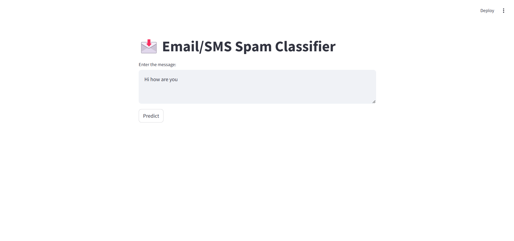

<h1 align="center">Email/SMS Spam Detection</h1>

<p align="center">
  
</p>

Click on the following link to checkout the Website.
- [Live Website](https://email-sms-spam-classifier-xm86.onrender.com)


---

## <br>**➲ Project description**
Email spam detection system is used to detect email spam using Machine Learning technique called Natural Language Processing and Python, where we have a dataset contain a lot of emails by extract important words and then use naive classifier we can detect if this email is spam or not.

## <br>**➲ Problem Statement**

Email spam, or junk mail, remains a persistent issue, flooding inboxes with unsolicited and often malicious content. These emails may contain cryptic messages, scams, or, most dangerously, phishing attempts. Our task, undertaken during an engaging data science internship provided by Oasis Infobyte, is to create an effective email spam detection system using Python and machine learning.

## <br>**➲ Prerequisites**
This is list of required packages and modules for the project to be installed :
* <a href="https://www.python.org/downloads/" target="_blank">Python 3.x</a>
* Pandas 
* Numpy
* Scikit-learn
* NLTK

Install all required packages :
 ```sh
  pip install -r requirements.txt
  ```

<!-- THE DATASET -->
## <br>**➲ The Dataset**
Human activites dataset contain about 5728 record which is a sample of an email
and a target column "spam" which describe the state of an email spam or not.<br>

<!-- CODING SECTIONS -->
## <br>**➲ Coding Sections**
In this part we will see the project code divided to sections as follows:
<br>

- Section 1 | The Data :<br>
In this section we aim to do some operations on the dataset before training the model on it,
processes like :
  1. Data Loading : Load the dataset
  2. Data Visualization : Visualize dataset features
  3. Data Cleaning : Remove stopwords and duplicates values
  4. Data Splitting : Split the dataset into training and testing sets<br><br>

- Section 2 | The Model :<br>
The dataset is ready for training, so we create a naive classifier using scikit-learn and thin fit it to the data, and finally we evaluate the model by getting accuracy, classification report and confusion matrix<br>

<!-- INSTALLATION -->
## ➲ Installation
1. Clone the repo
   ```sh
   git clone https://github.com/tushar8057/Email-SMS-Spam-Classifier.git
   ```
2. Open 'app.py' in VScode and enjoy

## <br>**➲ Model Deployment** 
The file ```app.py``` contains the complete code for deployment which is deployed in Streamlit. Streamlit is an open-source Python library that allows you to create interactive web applications for machine learning and data science projects.

To run the app.py file, Execute the following Command in your command prompt

 ```sh
    streamlit run app.py
  ```

<p align="center">
  
</p>

<!-- REFERENCES -->
## <br>**➲ References**
These links may help you to better understanding of the project idea and techniques used :
1. Spam detection in machine learning : https://bit.ly/3nwiKtA
2. Naive-bayes algorithm : https://bit.ly/3zc9SLH
3. Model evaluation : https://bit.ly/3B12VOO
